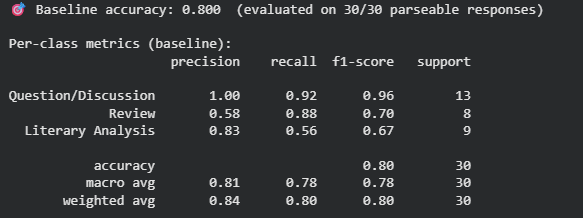

# 201-TakeMeter

## Community Choice and Reasoning

### Selected Community

[r/Books](https://www.reddit.com/r/books/wiki/relatedsubreddits/) - " a moderated subreddit [with the] intent and purpose to foster and encourage in-depth discussion about all things related to books, authors, genres, or publishing in a safe, supportive environment" (reddit bio)

### Reasoning

This community was chosen because book-lovers can be strongly opinonated about what they're reading. There is a lot active discourse which might make it difficult for new readers to navigate. Classification will help those new to the community, find exactly what they are looking for. Reviews are helpful for those looking for new books to read based on their general interests. Long term readers might be looking for literary analyses of their favorite books to discover new nuances. Others seeking community might go to questions/discussions to further engage with others. Readers have a diverse set of goals and perspective and by having clear labels, they will have a better experience engaging with the r/books reddit since it garners 10k+ weekly contributions with 1.3M weekly visitors. 

---

## Label Taxonomy

### Label Definitions

| Label   | Definition  | Common Signals
| ------- | ----------- | ----------- |
| Questions/Discussion          | These posts focus on inviting conversation, seeking, or sharing information | question marks, what do you think, why does, did anyone notice, requests for clarification/interpretation, news/article shared |
| Review                        | These opinion based posts focus on evaluation and personal judgement of a book.| ratings, 4/5 stars, personal reactions, really liked/didn't like, answer the question was it good |
| Literary Analysis             | These more formal posts focus on interpretation, themes, structure, techniques, or meaning. | discussion of theme, symbolism, character develpment, narrative structure, concrete evidence from the text, analysis of author's choices |

### Example Posts for Each Label

### Questions/Discussion 

* **Example 1:** "The Obama and Trump libraries are going digital. Historians aren’t sure that’s a good idea...Modern day burning of the Library of Alexandria. Control of the data can be as destructive as a fire.....Going fully digital sounds convenient but honestly feels risky when it comes to long-term preservation of history" ([source](https://www.reddit.com/r/books/comments/1u70erx/the_obama_and_trump_libraries_are_going_digital/))
* **Example 2**: "Why “book-shaming” won’t solve the children’s literacy crisis — The nation’s official advocate for children’s books says most of them are “crud.” But matters of literary quality don’t explain why kids aren’t reading" ([source](https://www.reddit.com/r/books/comments/1u81wxu/why_bookshaming_wont_solve_the_childrens_literacy/))
* **Boundary Example**: "Does anyone else think Freda Mac Fadens male character are supper repeative....A lot of the male characters seem to fall into either "perfect, supportive guy" or "secretly awful psychopath" with not much in between" ([source](https://www.reddit.com/r/bookdiscussion/comments/1tzt5zs/does_anyone_else_think_freda_mac_fadens_male/))
    - This example is borderline on literary analysis since it interprets character development in a novel. However, since it is posed as a question to the community it falls under this label. 

### Review

* **Example 1**: "Last year I read The Hobbit and The Lord of the Rings trilogy. Some thoughts....This was a rough read for me. Almost all of the little things I hadn't liked in previous books feel like they're crammed into this book" ([source](https://www.reddit.com/r/books/comments/1ualldt/last_year_i_read_the_hobbit_and_the_lord_of_the/))
* **Example 2**: "The Things We Never Say (Elizabeth Strout) - I don't understand the rating on this book
This book is 4.4 on Amazon (4.5k ratings) and 4.3 on Goodreads (10k ratings). I'm looking to see if anyone here has read it and has thoughts on the writing. The author won a Pulitzer Prize for another book, and this book is clearly in the bottom three books out of about 1000 books that I have ranked. The actual writing, not the story or plot, reads on a junior high student level. On nearly every page I was asking the author; "Why are you telling me this?" She has 500 paratheticals (like this one, but I didn't count) that added nothing (really) to the sentence (the string of words that form a singular thought.) I gave the book a 1/5, something I rarely do. Please tell me where I missed the boat on this book." ([source](https://www.reddit.com/r/books/comments/1tnmhmf/the_things_we_never_say_elizabeth_strout_i_dont/))
* **Boundary Example**: "With alternating timelines that shift from the present to the past to fill in the backstory, the pacing was too slow, and the story dragged multiple times while reading...With repetitive moments and side characters that didn’t add anything to the story, this was an unmemorable read, and that’s a shame.... give “The Children” by Melissa Albert a 2-Star rating out of 5."
    - This example is tricky since it does bring up some literary elements like pacing and character development. However, it is still overall an opinion pieces and does include a rating. ([source](https://www.reddit.com/r/books/comments/1ua03ru/review_the_children_by_melissa_albert/))


### Literary Analysis

* **Example 1**: "The Hunchback of Notre Dame and the tragedy of mistaken identity....This theme of dualism and duplicity is likewise represented by the character of the cathedral itself. In many ways, Hunchback is Hugo’s attempt to get us to read an essay about Notre Dame and gothic architecture by dressing it up in a novel" ([source](https://www.reddit.com/r/books/comments/1u7we9e/the_hunchback_of_notre_dame_and_the_tragedy_of/))
* **Example 2**: "Men are Shrimp - An Analysis of "The Youngest Doll" by Rosario Ferre...theme of this text is about how women are taken advantage of by men...rawn symbolizes the corruption, exploitation, and objectification of women" ([source](https://www.reddit.com/r/LiteraryAnalysis/comments/1sxxg6r/men_are_shrimp_an_analysis_of_the_youngest_doll/))
* **Boundary Example**: "The Vegetarian by Han Kang is Brilliantly Unsettling...The Vegetarian by Han Kang is Brilliantly Unsettling....he different POVs compliment the themes and intentions of each part well. For example, it definitely sets the tone that we start a book about a woman's decision with a first person POV from her husband"
     - This example does contain some opinion but is still an analysis because it overall focuses more on how literary elements contribute to the overall theme of the book. The focus is still interpretation and explaining how the book works, rather than personal judgement of the book. ([source](https://www.reddit.com/r/books/comments/1u62xne/the_vegetarian_by_han_kang_is_brilliantly/))

---

## Dataset Creation

### Data Collection Source + Label Process

Samples will be collected direclty from r/Books from the all time posts tab. The goal for label distribution is 33% for each label. However, from skimming the community it seems that the Question/Discussion label will be quite popular. Thus, it may skew more towards that specific label. Therefore, the goal will be 25%-40% label coverage of the 200 labels. If a label is underrepresented after 200 examples, then some of the most frequent labels will be swapped out. After asking ChatGPT to identify patterns with 5 posts that sit at the boundary, I added more keywords that belong to the labels to tighten up the definitions. 


### Label Distribution

| Label   | Count | Percentage |
| ------- | ----- | ---------- |
| Question/Discussion | 86     | 43%         |
| Review | 65     | 32.5%         |
| Literary Analysis | 49     | 24.5%         |

### Difficult-to-Label Examples

#### Example 1

**Post**

> "..."

**Decision:** Label X

**Reasoning:** Explain why.

#### Example 2

**Post**

> "..."

**Decision:** Label Y

**Reasoning:** Explain why.

#### Example 3

**Post**

> "..."

**Decision:** Label Z

**Reasoning:** Explain why.

---

## Fine-Tuning Approach

### Base Model

Specify the model used for fine-tuning.

### Training Setup

* Training/validation split
* Number of epochs
* Batch size
* Learning rate
* Any preprocessing steps

### Hyperparameter Decision

Discuss at least one important hyperparameter choice and why it was selected.

Example:

> I chose a learning rate of 2e-5 because higher values caused unstable validation loss during preliminary experiments.

---

## Zero-Shot Baseline

### Prompt Used

```text
You are classifying reddit posts from r/Books.
Assign each post to exactly one of the following categories.

Question/Discussion:	These posts focus on inviting conversation, seeking, or sharing information
Example: "Why “book-shaming” won’t solve the children’s literacy crisis — The nation’s official advocate for children’s books says most of them are “crud.” But matters of literary quality don’t explain why kids aren’t reading"

Review: These opinion based posts focus on evaluation and personal judgement of a book.
Example: "Last year I read The Hobbit and The Lord of the Rings trilogy. Some thoughts....This was a rough read for me. Almost all of the little things I hadn't liked in previous books feel like they're crammed into this boo"

Literary Analysis: These more formal posts focus on interpretation, themes, structure, techniques, or meaning.
Example: "The Hunchback of Notre Dame and the tragedy of mistaken identity....This theme of dualism and duplicity is likewise represented by the character of the cathedral itself. In many ways, Hunchback is Hugo’s attempt to get us to read an essay about Notre Dame and gothic architecture by dressing it up in a novel"

Respond with ONLY the label name.
Do not explain your reasoning.

Valid labels:
Question/Discussion
Review
Literary Analysis
```

### Evaluation Procedure


Describe:

* How predictions were collected
* Number of examples evaluated
* Any automation used

---

## Evaluation Results

### Overall Metrics

| Model              | Accuracy |
| ------------------ | -------- |
| Zero-Shot Baseline | X.XX     |
| Fine-Tuned Model   | X.XX     |

### Per-Class Metrics

| Label   | Precision | Recall | F1 |
| ------- | --------- | ------ | -- |
| Label 1 |           |        |    |
| Label 2 |           |        |    |
| Label 3 |           |        |    |

### Confusion Matrix

| Actual \ Predicted | Label 1 | Label 2 | Label 3 |
| ------------------ | ------- | ------- | ------- |
| Label 1            |         |         |         |
| Label 2            |         |         |         |
| Label 3            |         |         |         |

### Error Analysis

#### Incorrect Prediction 1

* **Actual Label:**
* **Predicted Label:**
* **Post:**
* **Analysis:**

#### Incorrect Prediction 2

* **Actual Label:**
* **Predicted Label:**
* **Post:**
* **Analysis:**

#### Incorrect Prediction 3

* **Actual Label:**
* **Predicted Label:**
* **Post:**
* **Analysis:**

### Sample Classifications

| Post      | Predicted Label | Confidence | Correct? |
| --------- | --------------- | ---------- | -------- |
| Example 1 |                 |            |          |
| Example 2 |                 |            |          |
| Example 3 |                 |            |          |
| Example 4 |                 |            |          |
| Example 5 |                 |            |          |

#### Correct Example Explanation

Choose one correctly classified example and explain why the model's prediction was appropriate.

---

## Reflection

### What the Model Learned

Discuss patterns the model appears to have captured successfully.

### What You Intended

Compare the learned behavior to your original labeling goals.

### Surprises

Describe any unexpected successes or failures.

---

## Specification Reflection

### How the Specification Helped

Describe one way the project specification improved your implementation process.

### Divergence from the Specification

Explain one way your implementation differed from the original specification and why that change was made.

---

## AI Usage Disclosure

### AI Assistance Instance #1

**Task:** Describe what you asked the AI to do.

**Output Used:** Explain what was incorporated.

**Your Revisions:** Describe modifications or corrections you made.

### AI Assistance Instance #2

**Task:** Describe what you asked the AI to do.

**Output Used:** Explain what was incorporated.

**Your Revisions:** Describe modifications or corrections you made.

### Annotation Assistance Disclosure

State whether AI was used during data annotation or labeling. If used, describe exactly how it assisted and how final labeling decisions were verified.

---

## Conclusion

Summarize:

* Dataset quality
* Fine-tuning results
* Comparison against the zero-shot baseline
* Key lessons learned
