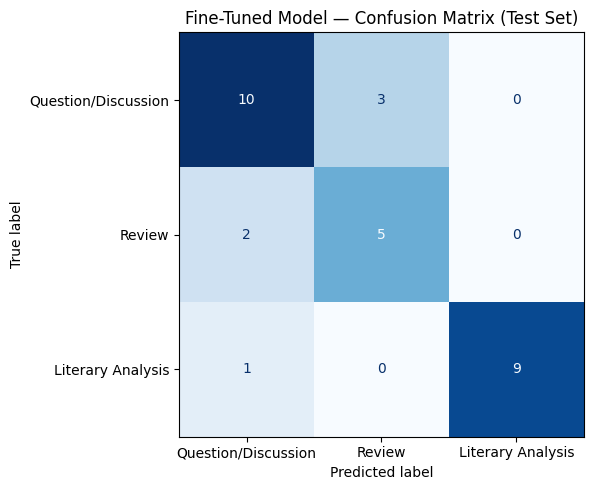

# 201-TakeMeter

## Community Choice and Reasoning

### Selected Community

[r/Books](https://www.reddit.com/r/books/wiki/relatedsubreddits/) - " a moderated subreddit [with the] intent and purpose to foster and encourage in-depth discussion about all things related to books, authors, genres, or publishing in a safe, supportive environment" (reddit bio)

### Reasoning

This community was chosen because book-lovers can be strongly opinonated about what they're reading. There is a lot active discourse which might make it difficult for new readers to navigate. Classification will help those new to the community, find exactly what they are looking for. Reviews are helpful for those looking for new books to read based on their general interests. Long term readers might be looking for literary analyses of their favorite books to discover new nuances. Others seeking community might go to questions/discussions to further engage with others. Readers have a diverse set of goals and perspective and by having clear labels, they will have a better experience engaging with the r/books reddit since it garners 10k+ weekly contributions with 1.3M weekly visitors. 

---

## Label Taxonomy

### Label Definitions

| Label   | Definition  | Common Signals
| ------- | ----------- | ----------- |
| Questions/Discussion          | These posts focus on inviting conversation, seeking, or sharing information | question marks, what do you think, why does, did anyone notice, requests for clarification/interpretation, news/article shared |
| Review                        | These opinion based posts focus on evaluation and personal judgement of a book.| ratings, 4/5 stars, personal reactions, really liked/didn't like, answer the question was it good |
| Literary Analysis             | These more formal posts focus on interpretation, themes, structure, techniques, or meaning. | discussion of theme, symbolism, character develpment, narrative structure, concrete evidence from the text, analysis of author's choices |

### Example Posts for Each Label

### Questions/Discussion 

* **Example 1:** "The Obama and Trump libraries are going digital. Historians aren’t sure that’s a good idea...Modern day burning of the Library of Alexandria. Control of the data can be as destructive as a fire.....Going fully digital sounds convenient but honestly feels risky when it comes to long-term preservation of history" ([source](https://www.reddit.com/r/books/comments/1u70erx/the_obama_and_trump_libraries_are_going_digital/))
* **Example 2**: "Why “book-shaming” won’t solve the children’s literacy crisis — The nation’s official advocate for children’s books says most of them are “crud.” But matters of literary quality don’t explain why kids aren’t reading" ([source](https://www.reddit.com/r/books/comments/1u81wxu/why_bookshaming_wont_solve_the_childrens_literacy/))
* **Boundary Example**: "Does anyone else think Freda Mac Fadens male character are supper repeative....A lot of the male characters seem to fall into either "perfect, supportive guy" or "secretly awful psychopath" with not much in between" ([source](https://www.reddit.com/r/bookdiscussion/comments/1tzt5zs/does_anyone_else_think_freda_mac_fadens_male/))
    - This example is borderline on literary analysis since it interprets character development in a novel. However, since it is posed as a question to the community it falls under this label. 

### Review

* **Example 1**: "Last year I read The Hobbit and The Lord of the Rings trilogy. Some thoughts....This was a rough read for me. Almost all of the little things I hadn't liked in previous books feel like they're crammed into this book" ([source](https://www.reddit.com/r/books/comments/1ualldt/last_year_i_read_the_hobbit_and_the_lord_of_the/))
* **Example 2**: "The Things We Never Say (Elizabeth Strout) - I don't understand the rating on this book
This book is 4.4 on Amazon (4.5k ratings) and 4.3 on Goodreads (10k ratings). I'm looking to see if anyone here has read it and has thoughts on the writing. The author won a Pulitzer Prize for another book, and this book is clearly in the bottom three books out of about 1000 books that I have ranked. The actual writing, not the story or plot, reads on a junior high student level. On nearly every page I was asking the author; "Why are you telling me this?" She has 500 paratheticals (like this one, but I didn't count) that added nothing (really) to the sentence (the string of words that form a singular thought.) I gave the book a 1/5, something I rarely do. Please tell me where I missed the boat on this book." ([source](https://www.reddit.com/r/books/comments/1tnmhmf/the_things_we_never_say_elizabeth_strout_i_dont/))
* **Boundary Example**: "With alternating timelines that shift from the present to the past to fill in the backstory, the pacing was too slow, and the story dragged multiple times while reading...With repetitive moments and side characters that didn’t add anything to the story, this was an unmemorable read, and that’s a shame.... give “The Children” by Melissa Albert a 2-Star rating out of 5."
    - This example is tricky since it does bring up some literary elements like pacing and character development. However, it is still overall an opinion pieces and does include a rating. ([source](https://www.reddit.com/r/books/comments/1ua03ru/review_the_children_by_melissa_albert/))


### Literary Analysis

* **Example 1**: "The Hunchback of Notre Dame and the tragedy of mistaken identity....This theme of dualism and duplicity is likewise represented by the character of the cathedral itself. In many ways, Hunchback is Hugo’s attempt to get us to read an essay about Notre Dame and gothic architecture by dressing it up in a novel" ([source](https://www.reddit.com/r/books/comments/1u7we9e/the_hunchback_of_notre_dame_and_the_tragedy_of/))
* **Example 2**: "Men are Shrimp - An Analysis of "The Youngest Doll" by Rosario Ferre...theme of this text is about how women are taken advantage of by men...rawn symbolizes the corruption, exploitation, and objectification of women" ([source](https://www.reddit.com/r/LiteraryAnalysis/comments/1sxxg6r/men_are_shrimp_an_analysis_of_the_youngest_doll/))
* **Boundary Example**: "The Vegetarian by Han Kang is Brilliantly Unsettling...The Vegetarian by Han Kang is Brilliantly Unsettling....he different POVs compliment the themes and intentions of each part well. For example, it definitely sets the tone that we start a book about a woman's decision with a first person POV from her husband"
     - This example does contain some opinion but is still an analysis because it overall focuses more on how literary elements contribute to the overall theme of the book. The focus is still interpretation and explaining how the book works, rather than personal judgement of the book. ([source](https://www.reddit.com/r/books/comments/1u62xne/the_vegetarian_by_han_kang_is_brilliantly/))

---

## Dataset Creation

### Data Collection Source + Label Process

Samples will be collected direclty from r/Books from the all time posts tab. The goal for label distribution is 33% for each label. However, from skimming the community it seems that the Question/Discussion label will be quite popular. Thus, it may skew more towards that specific label. Therefore, the goal will be 25%-40% label coverage of the 200 labels. If a label is underrepresented after 200 examples, then some of the most frequent labels will be swapped out. After asking ChatGPT to identify patterns with 5 posts that sit at the boundary, I added more keywords that belong to the labels to tighten up the definitions. 


### Label Distribution

| Label   | Count | Percentage |
| ------- | ----- | ---------- |
| Question/Discussion | 86     | 43%         |
| Review | 68     | 34%         |
| Literary Analysis | 49     | 23%         |

---

## Fine-Tuning Approach

### Base Model

The model is distilbert-base-uncased, and the training platform is Google Colab. 

### Training Setup

* Training/validation split: 70% train/15% validation/15% test
* Number of epochs: 6 
* Batch size: 16
* Learning rate: 2e-5

### Hyperparameter Decision

I chose to increase the number of epochs from 3 to 6 because the accuracy would jump drastically from 2 to 3. This might indiciate that while the model was still improving, training ended prematurely at 3 epochs. I saw the validation accuracy start to plateau around 4/5 epochs which also correlated with a higher accuracy score. 

---

## Zero-Shot Baseline

### Prompt Used

```text
You are classifying reddit posts from r/Books.
Assign each post to exactly one of the following categories.

Question/Discussion:	These posts focus on inviting conversation, seeking, or sharing information. Look for question marks, what do you think, why does, did anyone notice, requests for clarification/interpretation, news/article shared. 
Example: "Why “book-shaming” won’t solve the children’s literacy crisis — The nation’s official advocate for children’s books says most of them are “crud.” But matters of literary quality don’t explain why kids aren’t reading"

Review: These opinion based posts focus on evaluation and personal judgement of a book. Look for ratings like 4/5 stars, personal or emotional reactions, really liked/didn't like, answer the question was it good.
Example: "Last year I read The Hobbit and The Lord of the Rings trilogy. Some thoughts....This was a rough read for me. Almost all of the little things I hadn't liked in previous books feel like they're crammed into this boo"

Literary Analysis: These more formal posts focus on interpretation, themes, structure, techniques, or meaning. Look for discussion of theme, symbolism, character develpment, narrative structure, concrete evidence from the text, analysis of author's choices.
Example: "The Hunchback of Notre Dame and the tragedy of mistaken identity....This theme of dualism and duplicity is likewise represented by the character of the cathedral itself. In many ways, Hunchback is Hugo’s attempt to get us to read an essay about Notre Dame and gothic architecture by dressing it up in a novel"

Respond with ONLY the label name.
Do not explain your reasoning.

Valid labels:
Question/Discussion
Review
Literary Analysis
```
### Baseline Evaluation

| Label   | Precision | Recall | F1 |
| ------- | --------- | ------ | -- |
| Question/Discussion |  0.93         |   1.00     |   0.96  |
| Review              |  0.55         |   0.86    |  0.67  |
| Literary Analysis   |  1.00        |   0.50     |  0.67  |


## Evaluation Results

### Overall Metrics

| Model              | Accuracy |
| ------------------ | -------- |
| Zero-Shot Baseline | 0.80     |
| Fine-Tuned Model   | 0.80     |

### Per-Class Metrics

| Label   | Precision | Recall | F1 |
| ------- | --------- | ------ | -- |
| Question/Discussion |   0.77        |    0.77    |   0.77  |
| Review              |   0.62       |   0.71     |  0.67  |
| Literary Analysis   |   1.00        |  0.90      |  0.95  |

### Confusion Matrix

| True  \ Predicted | Question/Discussion | Review | Literary Analysis |
| ------------------ | ------- | ------- | ------- |
| Question/Discussion |  10       |   3      |      0   |
| Review                |   2      |    5     |     0    |
| Literary Analysis   |     1    |      0   |    9     |



### Error Analysis

#### Incorrect Prediction 1

* **Actual Label:** Review
* **Predicted Label:** Question/Discussion
* **Post:**
```text
Phantom Tollbooth was my intro to Hitchhiker’s Guide-style humor and one of my favorite children’s books
I was in elementary school when I last read The Phantom Tollbooth, so I might be misremembering a few things, but that book was my introduction to the sort of—I dunno how to really label it, but that sort of humor that The Hitchhiker’s Guide to the Galaxy is built on. I feel like the sort of direct but misplaced logic, literal nature of things, and the personification or anthropomorphism of concepts we take for granted is a great introduction to absurdist humor (that was the word I was looking for!) to kids. Places like Dictionopolis and Digitopolis showing another side of words and numbers, for example.
When it comes to books, I feel like the “yeah, that makes sense, I guess” brand of absurdism is the most fun and the most thought-provoking.
```
* **Analysis:** The model likely predicted Question/Discussion because the post focuses on the author's thoughts about absurdist humor and its impact rather than directly evaluating the book. The reflective and conversational tone makes it resemble a discussion post more than a traditional review.

#### Incorrect Prediction 2

* **Actual Label:** Question/Discussion
* **Predicted Label:** Review  
* **Post:**
```text
What book had you underlining/annotating the most passages?
I recently read Faces in the Water, by Janet Frame, and every other page had some beautiful heartbreaking passage I wanted to underline and come back to later. It was a library book, so I didn't, but I'm considering getting my own copy to re-read and annotate. It's a fictionalised account of Frame's real-life experiences in Seacliff Lunatic Asylum during the 1940s. The whole book is swept along in a feeling of helplessness and loss in captivating language. Here are a couple that really stuck with me:
"I did not know my own identity. I was burgled of body and hung in the sky like a woman of straw."
"There is no past or future. Using tenses to divide time is like making chalk marks on water."
"And the days passed, packing and piling themselves together like sheets of absorbent material, deadening the sound of our lives, even to ourselves, so that perhaps if a tomorrow ever came it would not hear us; its new days would bury us, in its own name; we would be like people entombed when the rescuers, walking about in the dark waving lanterns and calling to us, eventually give up because no one answers them; sometimes they dig and find the victims dead."
What book had you scribbling in the margins and underlining passages and copying out quotes to come back to later?
```
* **Analysis:** The model likely predicted Review because the post begins with a personal reaction to a book and includes several quoted passages along with praise for the writing. However, the primary purpose of the post is to ask the community a question, making Question/Discussion the correct label.

#### Incorrect Prediction 3

* **Actual Label:** Literary Analysis
* **Predicted Label:** Question/Discussion  (confidence: 0.88)
* **Post:**
```text
Comics and literature, two different media. Many comics are published in book format. Even webcomics tend to be, in most cases, works that could be published in that format, with exceptions being those webcomics which make use of sound, animation or other resources which would be impossible to reproduce in print.
That being said, comics are not literature, which is fundamentally verbal; they are instead their own medium, like sculpture or cinema, and it is quite unfortunate to see how often it is diminished in favor of associating these works with literature which is perceived as “nobler”...
Comics themselves tend to feature textual elements, but also pictorial ones, and in a broader sense visual and spatial ones (page layout, sequentiality), and are ultimately their very own medium. A term such as “audiovisual novel” is not used outside of metaphorical contexts to refer to a movie, for instance...
TL;DR: Comics are not literary works, nor are they less valuable as an artistic medium than literature, just as painting, sculpture, and music are not inferior to it.
```
* **Analysis:** The model likely predicted Question/Discussion because the post presents a broad argument about comics and literature rather than analyzing a specific literary work. Its discussion-oriented style may have obscured the analytical reasoning that led to the Literary Analysis label.

### Sample Classifications

| Post      | Predicted Label | Confidence | Correct? |
| --------- | --------------- | ---------- | -------- |
| LitHub: A prize-winning story published in Granta was (very likely) written by AI |  Question/Discussion               |  0.95          |  yes        |
| About redemption and liberation in Les Misérables. Jean Valjean lives tormented by guilt. What the bishop did for Jean Valjean was not to free him, but to imprison him in and immense sense of guilt tha... |   Literary Analysis              |    0.88        |    yes      |
| Reattempted Katabasis by RF Kuang...And thank god I finished it this time so I didn't have to think about it any more. What a waste of 35$. I might have been open to like 10$ second hand, but I do no... |    Review             |     0.76       |   yes       |
| Starving Saints by Caitlin Starling (and why I hated it). I want to start of by stating that I picked up The Starving Saints by Caitlin Starling thinking I would love it. It was in the same section... |     Review            |    0.72        |     yes     |
|  Clicking & Not Clicking with Different Writing Styles. Ever have that moment where you open a book and immediately can tell you and that writing style are not gonna click? |    Question/Discussion             |    0.86        |   yes       |

#### Correct Example Explanation

<!-- Choose one correctly classified example and explain why the model's prediction was appropriate. -->
Example number 3 is a prime example of a personal review. The model accurately identified the more informal and emotional diction from that post like "what a waste" and "thank god I finished it this time". It is clearly a post about a reader's opinion. 

---

## Reflection
<!-- A reflection on the gap between what the model captured and what was intended — describes a specific failure pattern (a label pair, a post type, a distributional issue) rather than a generic observation like "it needs more data." -->

The largest gap between the intended and the learned behavior involved distinguishing Question/Discussion posts from Review posts. Many discussion posts began with personal reading experiences or opinions before asking a question to the community. The model often focused on these opinionated opening statements and classified the post as a Review even when the primary purpose was to encourage discussion.

### What the Model Learned

<!-- Discuss patterns the model appears to have captured successfully. -->
The model most successfully distinguishes literary analysis with both high precision and high recall for an f1 of 0.95. It did a good job of flagging these kinds of post though dicussion of symbolism, characterization, and narrative structure. It also performed decently for question/discussion, especially for broader discussion of general reading habits or new stories. The confusion matrix confirms this as well, with the highest numbers in the diagonals corresponding to these 2 labels. 

### What You Intended

<!-- Compare the learned behavior to your original labeling goals. -->
The original goal was for the model to distinguish between posts that evaluate books (Review), posts that interpret books (Literary Analysis), and posts that invite conversation (Question/Discussion). While the model largely achieved this distinction for Literary Analysis and Question/Discussion, it struggled to consistently identify Review posts. Many Review examples shared language features with the other two labels, making the intended boundary less clear than expected.

### Surprises

<!-- Describe any unexpected successes or failures. -->
The most surprising result was that the anticipated edge case between Review and Literary Analysis was not the model's primary source of error. Instead, most mistakes occurred between Review and Question/Discussion. Another unexpected result was that the fine-tuned DistilBERT model mirrored the zero-shot baseline, suggesting that the larger language model benefited from extensive pretraining and the detailed prompt definitions.

---

## Specification Reflection

### How the Specification Helped

<!-- Describe one way the project specification improved your implementation process. -->
The spec helped me brainstorm how to clearly label definitions for my data. It also encouraged me to stay close to the dataset and how to use AI to help with the annotation and model evaluation. This helped make my labeling more consistent and helped me uncover patterns in the model that I hadn't noticed before. It also defined helpful terms and metrics to evaluate the success of the model. 

### Divergence from the Specification

<!-- Explain one way your implementation differed from the original specification and why that change was made. -->
The spec encouraged me to hypothesize the most diffcult challenge for the model, and make recommendations based on that. However, the model struggling with the review section specficially was surprising to me. Also, I had to manually make some edits to ensure label consistency that the spec didn't mention. 

---

## AI Usage Disclosure

### AI Assistance Instance #1

**Task:** Asked ChatGPT to review the label taxonomy and generate edge-case examples that sat between Review and Literary Analysis.

**Output Used:** Several generated examples were used to test whether the label definitions were sufficiently distinct before annotation began

**Your Revisions:** I refined the definitions by emphasizing the difference between evaluating a book (Review) and interpreting how a book creates meaning (Literary Analysis).

### AI Assistance Instance #2

**Task:** Asked ChatGPT to analyze model errors and identify common patterns in the misclassified examples.

**Output Used:** e AI identified recurring confusion between Question/Discussion and Review posts and suggested possible explanations for the pattern.

**Your Revisions:** I manually reviewed each incorrect prediction and verified the suggested patterns before incorporating them into the evaluation section. I also rejected the AI's initial assumption that Review and Literary Analysis would be the dominant source of confusion because the confusion matrix did not support that conclusion.

### Annotation Assistance Disclosure

AI was not used during data annotation or labeling. 
